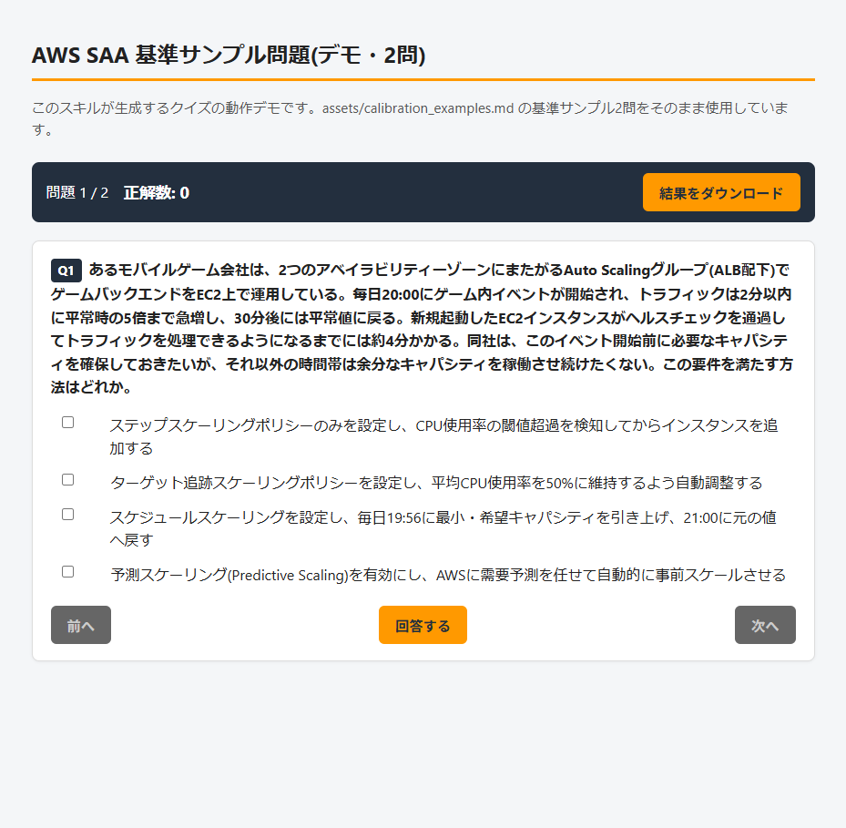
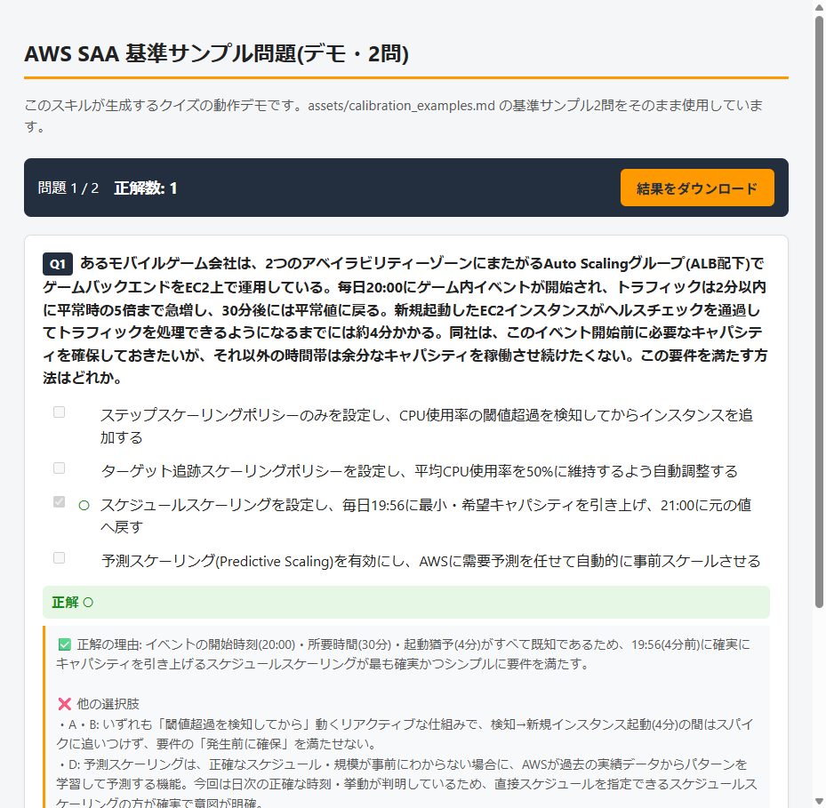

# claude-aws-quiz-skill

[Claude Code](https://claude.com/claude-code) 用のカスタムスキル。AWS認定試験対策の複数選択(2つ選べ)問題クイズを、単一HTMLファイルとして生成する。

**ライブデモ(基準サンプル2問):** https://glico1tubu300meter.github.io/claude-aws-quiz-skill/demo/

| 出題画面 | 回答後(解説表示) |
| --- | --- |
|  |  |

## できること

- 会話中の要望(試験区分・難易度・トピック・問題数)に応じて、1問ずつ回答して
  その場で正誤と解説を確認できるクイズHTMLを作成する
- 正解の選択肢位置(A〜E)が偏らないよう自己チェックしながら出題する
- 誤答選択肢は「一見正しそうだが技術的に誤り」という実試験相当の難易度にキャリブレーション
  (常識だけで消去できる極端な誤答は使わない)
- 生成されるHTMLは外部CDN依存なしの単一ファイルで、回答状況を `localStorage` に自動保存
  (途中から再開可能)し、結果をテキストでダウンロードできる

## インストール

このリポジトリの内容を Claude Code のスキルディレクトリにコピーする。

```bash
git clone https://github.com/glico1tubu300meter/claude-aws-quiz-skill.git
cp -r claude-aws-quiz-skill ~/.claude/skills/aws-quiz
```

Windows (PowerShell) の場合:

```powershell
git clone https://github.com/glico1tubu300meter/claude-aws-quiz-skill.git
Copy-Item -Recurse claude-aws-quiz-skill "$env:USERPROFILE\.claude\skills\aws-quiz"
```

## 使い方

Claude Code のチャットで以下のように依頼する。

```
AWS SAAのクイズを20問作って
```

```
/aws-quiz 応用編でEC2まわりの問題を10問
```

## 構成

```
SKILL.md                        スキル定義(手順・品質基準)
assets/template.html            クイズHTMLのベーステンプレート
assets/calibration_examples.md  難易度・品質の基準サンプル問題
```

初回利用時に自身で `quiz_log.md`(出題済みトピックの記録用ファイル)を
スキルディレクトリ内に作成し、以後の重複回避に使う(このリポジトリには含まれない)。

## ライセンス

特に指定なし。自由に利用・改変してよい。
